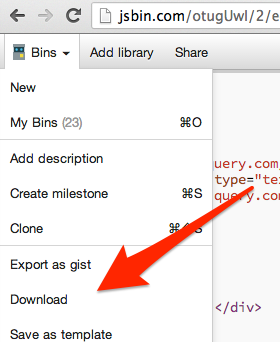

# Advanced JavaScript syllabus

***See this README with a table of contents [here](http://documentup.com/advanced-js/syllabus).***

* **Course:** [INFO1-CE9766, NYU SCPS](http://scps.nyu.edu/content/scps/academics/course_detail.html?id=INFO1-CE9766)
* **Instructor:** Aidan Feldman, alf9@nyu.edu
* **Need help?**
   * Look through and create [issues](https://github.com/advanced-js/syllabus/issues)
   * Office Hours on Sundays during [Hacker Hours](http://hackerhours.org/) (see [Meetup page](http://www.meetup.com/hackerhours/events/calendar/) for schedule)
   * [Email](alf9@nyu.edu) for 1-on-1 help, or to set up a time to meet

## Course Description

Learn best practices in JavaScript in this intensive, five-session course. Topics include data encapsulation, closures, binding, inheritance, and name spacing. Discover some of the lesser-known, yet useful, features of the language, such as how to debug JavaScript problems on different browsers and improve performance. Create interactive webpages using third-party JavaScript libraries.

Computers are provided in the lab, though you are encouraged to bring a laptop for in-class exercises.

## Prerequisites

* [INFO1-CE9755 - JavaScript](http://scps.nyu.edu/content/scps/academics/course_detail.html?id=INFO1-CE9755) ([syllabus](https://github.com/advanced-js/syllabus/blob/master/vendor/INFO1-CE9755%20JavaScript.pdf?raw=true)) or equivalent
* Understanding of variables, data types, control flow, and basic function usage in JavaScript - see [Beginner Materials](#beginner-materials)
* Strong intermediate knowledge of HTML, and at least basics of CSS
* Basic jQuery knowledge (DOM interaction) is a plus

These won't be enforced by the instructor, but you will be pretty lost without understanding those concepts.

## Course Overview

We will dive into the nuances of JavaScript, how prototypal inheritance compares to classical inheritance, and how this can be used to build dynamic and complex web applications.  Modern tools like jQuery and BackboneJS will be discussed, but students will learn the building blocks of these frameworks and after this course be able to understand what is happening under the hood.  The focus will be on development for browsers, though most applies to other systems like Node.js, Phonegap, etc.  Topics covered include:

* Encapsulation, closures and scope
* Classical vs. prototypal inheritance
* The event loop
* AJAX and JSONP
    * local
    * remote (e.g. Foursquare)
* Creating MVC-style models (a'la Backbone.js) from scratch
* Test- and Pseudocode-Driven Development

Topics will be demonstrated through live-code examples/slides, available at [advanced-js.github.io/deck](http://advanced-js.github.io/deck/).  Additional exercises will completed in-class.

See [this interview](http://masterstreet.wordpress.com/2013/09/05/interview-with-aidan-feldman-instructor-at-nyu-scps/) for more background.

## Homework/Projects

All assignments are listed within the [Course Outline](#course-outline).

### Workflow

1. Fork the repository for the exercise/project (found under [github.com/advanced-js](https://github.com/advanced-js))
1. Clone the repository to your computer
1. Open the `index.html` file in a browser and open the Developer Tools
1. Modify the files to complete your solution
1. Refresh the `index.html` page to see the results, and repeat
1. Make sure all of your code is committed
1. Push/sync up to GitHub
1. [Create a pull request](https://help.github.com/articles/creating-a-pull-request) on the original repository
1. Submit a link to your pull request in the assignment in [NYU Classes](https://newclasses.nyu.edu) by the due time (generally the start of the following class)

Feedback will be given in the pull request, and you can continue to push fixes and improvements until the close date (listed in Classes).  Note that your solution will also be live at `http://USERNAME.github.io/EXERCISE`.

### Requirements

These apply to real life, as well.

* All HTML files should pass [W3C Markup Validation](http://validator.w3.org/)
* All written JS should pass [JSHint](http://jshint.com/)
* Must apply "good programming style" learned in class
    * Functions should be "short" (see [Sandi Metz's rules for developers](http://robots.thoughtbot.com/post/50655960596/sandi-metz-rules-for-developers))
    * Optimize for readability
    * For projects, use Object-Oriented Programming
* Bonus points for:
    * [Automated tests](#test-frameworks)
    * Creativity (as long as requirements are fulfilled)

## Course Outline

### Class 1

* Introduction
    * Install GitHub for [Mac](https://mac.github.com) or [Windows](https://windows.github.com)
    * Sign up for GitHub
* Student checklist:
    * "Watch" this repository

        

    * Access [NYU Classes](https://newclasses.nyu.edu) page
        * [Documentation](https://wikis.nyu.edu/display/nyuclasses/Student+Quick-Start)
* Explain how slides work
    * Look at [helpers.js](https://github.com/advanced-js/deck/blob/gh-pages/assets/helpers.js)
* Get through `echo_exercise` slide
* GitHub workflow
    * [Organization](https://github.com/advanced-js) walkthrough
    * Create pull request on [demo repository](https://github.com/advanced-js/pr-demo)
* Get through "self_executing_functions" slide
* Homework:
    * Read [JavaScript Garden](http://bonsaiden.github.com/JavaScript-Garden/)
    * Finish up and submit [echo](https://github.com/advanced-js/echo) and [countdown](https://github.com/advanced-js/blink) exercises
    * Complete [blink](https://github.com/advanced-js/blink) exercise

### Class 2

* Look at various approaches for `countdown()`
    * Show recursive solution
* Pair program to build [Memory v1](projects/memory.md) (see [pairing tips](#pairing-tips))
* Cover OOP, though "oop_inheritance" slide
    * [Encapsulation example](http://jsbin.com/eGiteJa/2/edit?css,js,output)
    * Look at [Backbone.js Events](http://backbonejs.org/docs/backbone.html)
* Cover automated testing
    * Examples in QUnit
        * [Simple](http://jsbin.com/AqENEjo/1/edit?html,js,output)
        * [Classes](http://jsbin.com/edoRoGU/1/edit?js,output)
    * [Other frameworks](#test-frameworks)
* Homework:
    * Read [Google JavaScript Style Guide](http://google-styleguide.googlecode.com/svn/trunk/javascriptguide.xml)
    * [Memory v2](projects/memory.md#v2) (individual)

### Class 3

* Code review Memory
* Finish slides
* Developer Tools walkthrough
    * Elements (HTML)
    * Console (JS)
    * Scripts (JS)
* Cover AJAX/JSONP ([files](demos/ajax))
    * Network tab in Developer Tools
* Homework:
    * [Mashup](projects/mashup.md) v1

### Class 4

* Mashup demos
* Add tests to namespace
    * Build up a test framework from scratch
    * Show QUnit
* Getting Serious example
    * Quick intro to Backbone.js
        * [Boilerplate](http://jsbin.com/IGivato/1/edit?html,js,output)
        * Click the Box [example app](http://jsbin.com/IGivato/5/edit?css,js,output)
        * TDD?
* Multiple async
    * Promises/[jQuery.Deferred](http://api.jquery.com/jQuery.Deferred/)
    * Possibly show [async](https://github.com/caolan/async#control-flow-1) library?
* Homework:re
    * [Mashup](projects/mashup.md) v2

### Class 5

* Present and code review Mashup projects
* Possible topics (vote?):
    * Node.js
        * Server "Hello World" (from [Node.js homepage](http://nodejs.org/))
            * [HTTP module docs](http://nodejs.org/api/http.html)
        * HTTP requests
            * [Status codes](http://pretty-rfc.herokuapp.com/RFC2616#status.codes)
            * Headers
        * CommonJS?
    * [Regular Expressions](demos/regex.html)
        * Convert live input, e.g. link Twitter handles from a textarea
    * Command-line and Git

## Projects

Possible projects are listed [here](projects).

## Pairing Tips

* Three people is possible, but two works best
* Agree on an editor and environment that you're both comfortable with
* The person who's less experienced/comfortable should have more keyboard time
* Switch who's "driving" regularly
* Make sure to save the code and send it to both people
* [JS Bin](http://jsbin.com/) supports live collaborating

## Resources

### More Examples

* [map/reduce](http://jsbin.com/ojapAsUR/2/edit?js) (in [Underscore](http://underscorejs.org/#map))

### Required Reading

* [Google JavaScript Style Guide](http://google-styleguide.googlecode.com/svn/trunk/javascriptguide.xml)
* [JavaScript Garden](http://bonsaiden.github.com/JavaScript-Garden/)
* [Mozilla's Introduction to Object-Oriented Javascript](https://developer.mozilla.org/en-US/docs/Web/JavaScript/Introduction_to_Object-Oriented_JavaScript)
* https://twitter.com/necolas/status/291978260433219584
* http://afeld.me/nerdery/1742468

### Recommended Reading

* [Classical Inheritance in JavaScript](http://www.crockford.com/javascript/inheritance.html) by Douglas Crockford
* [Front-end Job Interview Questions](https://github.com/darcyclarke/Front-end-Developer-Interview-Questions) by @darcyclarke (for testing yourself)
* [HTML5 Rocks slides](http://slides.html5rocks.com/)
* [JavaScript Best Practices](http://www.thinkful.com/learn/javascript-best-practices-1/)
* [JavaScript Patterns](http://shichuan.github.com/javascript-patterns/) by @shichuan (thanks @iandrewfuchs)
* [JavaScript Patterns](http://www.amazon.com/JavaScript-Patterns-Stoyan-Stefanov/dp/0596806752) by Stoyan Stephanov
* [JavaScript Web Applications](http://www.amazon.com/JavaScript-Web-Applications-Alex-MacCaw/dp/144930351X/) by Alex MacCaw
* [JavaScript: The Good Parts](http://www.amazon.com/JavaScript-Good-Parts-Douglas-Crockford/dp/0596517742) by Douglas Crockford
* [Learning Advanced JavaScript slides](http://ejohn.org/apps/learn/) by John Resig
* [Learning JavaScript Design Patterns](http://addyosmani.com/resources/essentialjsdesignpatterns/book/) by Addy Osmani
* [Partial Application in JavaScript](http://benalman.com/news/2012/09/partial-application-in-javascript/) by Ben Alman (thanks @michaelBenin)
* [Test-Driven JavaScript Development](http://www.amazon.com/Test-Driven-JavaScript-Development-Developers-Library/dp/0321683919) by Christian Johansen
* [The JavaScript Interpreter, Interpreted](http://www.slideshare.net/marthakelly/js-interpreter-interpreted) by Martha Girdler [(video)](http://www.youtube.com/watch?v=iSxNCYcPAFk)

### Beginner Materials

This class assumes you are confident with this material, but in case you need a brush-up...

* [Codecademy](http://www.codecademy.com/tracks/javascript)
* [Eloquent JavaScript](http://eloquentjavascript.net/index.html) by Marijn Haverbeke, Chapters 1-5

### Other Lists

* [JS: The Right Way](http://www.jstherightway.org/) (an overview of the JS landscape)
* [Code School](http://www.codeschool.com/paths/javascript)
* Thoughtbot's [Javascript Trail Map](https://learn.thoughtbot.com/javascript)
* [How To Learn JavaScript Properly](http://javascriptissexy.com/how-to-learn-javascript-properly/)
* [Teach Yourself to Code](http://teachyourselftocode.com/)

### Tools

* code validation: [JSLint](http://jslint.com) / [JSHint](http://jshint.com)
* debugging: [Chrome Developer Tools](https://developers.google.com/chrome-developer-tools/docs/overview) ([tutorial](http://code.google.com/chrome/extensions/tut_debugging.html)) / [Firebug](http://getfirebug.com/)
* sharing code snippets: [gist.github.com](https://gist.github.com/)
* asking questions: [Stack Overflow](http://stackoverflow.com/)

#### HTML/CSS/JS sandbox

* [JS Bin](http://jsbin.com/) (recommended)
* [bl.ocks.org](http://bl.ocks.org/)
* [Cloud9](https://c9.io/)
* [CodePen](http://codepen.io/pen/)
* [jsFiddle](http://jsfiddle.net/)
* [Plunker](http://plnkr.co/)
* [rawgithub.com](http://rawgithub.com/)

#### Test Frameworks

Recommended:

* [QUnit](http://qunitjs.com/) (the simplest one)
    * [boilerplate](http://jsbin.com/otugUwI/1/edit?html,js,output)
        * If you prefer to work locally, choose "Download" from the menu.

            

* [Jasmine](http://pivotal.github.io/jasmine/)
* [Mocha](http://visionmedia.github.io/mocha/)

### Reference

* [Mozilla Developer Network](https://developer.mozilla.org/en/JavaScript) and [Learn JavaScript](https://developer.mozilla.org/en-US/learn/javascript)
* [w3schools](http://www.w3schools.com/jsref/default.asp)
* [JavaScript: The Definitive Guide](http://shop.oreilly.com/product/9780596000486.do) by David Flanagan

### GitHub

* Git and GitHub
    * [Official GitHub Help](https://help.github.com/)
    * [Recommended resources](https://help.github.com/articles/what-are-other-good-resources-for-learning-git-and-github)
* GitHub Pages
    * [Official site](http://pages.github.com/)
    * [Thinkful guide](http://www.thinkful.com/learn/a-guide-to-using-github-pages/)

## Grading

* Class Participation – 30%
* Homework – 70%

## Statements on Plagiarism

### SCPS

> New York University takes plagiarism very seriously and regards it as a form of fraud.  The definition of plagiarism that has been adopted by the School of Continuing and Professional Studies is as follows: "Plagiarism is presenting someone else's work as though it were one's own.  More specifically, plagiarism is to present as one's own words quoted without quotation marks from another writer; a paraphrased passage from another writer’s work; or facts or ideas gathered, organized, and reported by someone else, orally and/or in writing.  Since plagiarism is a matter of fact, not of the student's intention, it is crucial that acknowledgement of the sources be accurate and complete.  Even where there is not a conscious intention to deceive, the failure to make appropriate acknowledgement constitutes plagiarism.  Penalties for plagiarism range from failure for a paper or course to dismissal from the University.

### Instructor

Reuse and building upon ideas or code are major parts of modern software development.  As a professional programmer you will never write anything from scratch.  This class is structured such that all solutions are public.  You are encouraged to learn from the work of your peers.  I won't hunt down people who are simply copying-and-pasting solutions, because without challenging themselves, they  are simply wasting their time and money taking this class.

Please respect the terms of use and/or license of any code you find, and if you reimplement or duplicate an algorithm or code from elsewhere, credit the original source with an inline comment.
