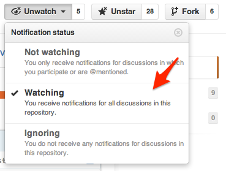

# Advanced JavaScript

***See this README prettier [here](http://documentup.com/afeld/advanced_js).***

* **Course:** [INFO1-CE9766, NYU SCPS](http://scps.nyu.edu/content/scps/academics/course_detail.html?id=INFO1-CE9766)
* **Instructor:** Aidan Feldman, alf9@nyu.edu
* **Need help?**
   * [Issues](https://github.com/afeld/advanced_js/issues) (please don't post solutions)
   * Office Hours on Sundays during [Hacker Hours](http://hackerhours.org/) (see [Meetup page](http://www.meetup.com/hackerhours/events/calendar/) for schedule)
   * [Email](alf9@nyu.edu) for 1-on-1 help, or to set up a time to meet

## Course Description

Learn best practices in JavaScript in this intensive, five-session course. Topics include data encapsulation, closures, binding, inheritance, and name spacing. Discover some of the lesser-known, yet useful, features of the language, such as how to debug JavaScript problems on different browsers and improve performance. Create interactive webpages using third-party JavaScript libraries.

## Prerequisites

* [INFO1-CE9755 - JavaScript](http://scps.nyu.edu/content/scps/academics/course_detail.html?id=INFO1-CE9755) ([syllabus](https://github.com/afeld/advanced_js/blob/master/vendor/INFO1-CE9755%20JavaScript.pdf?raw=true)) or equivalent
* Understanding of variables, data types, control flow, and basic function usage in JavaScript - see [Beginner Materials](#beginner-materials)
* Strong intermediate knowledge of HTML, and at least basics of CSS
* Basic jQuery knowledge (DOM interaction) is a plus

These won't be enforced by the instructor, but you will be pretty lost without understanding those concepts.

## Course Overview

We will dive into the nuances of JavaScript, how prototypal inheritance compares to classical inheritance, and how this can be used to build dynamic and complex web applications.  Modern tools like jQuery and BackboneJS will be discussed, but students will learn the building blocks of these frameworks and after this course be able to understand what is happening under the hood.  The focus will be on development for browsers, though most applies to other systems like Node.js, Phonegap, etc.  Topics covered include:

* Encapsulation, closures and scope
* Classical vs. prototypal inheritance
* The event loop
* AJAX and JSONP
    * local
    * remote (e.g. Foursquare)
* Creating MVC-style models (a'la Backbone.js) from scratch
* Test- and Pseudocode-Driven Development

Topics will be demonstrated through live-code examples/slides, available at [afeld.github.io/advanced_js](http://afeld.github.io/advanced_js/).  Additional exercises will completed in-class.

See [this interview](http://masterstreet.wordpress.com/2013/09/05/interview-with-aidan-feldman-instructor-at-nyu-scps/) for more background.

## Homework/Projects

All assignments are listed within the [Course Outline](#course-outline).

### Submission

Submit homework and projects via [NYU Classes](https://newclasses.nyu.edu) by the start of the following class.  Sumbissions can be in one of the following formats:

* A link to the project hosted live
    * On your own site
    * An online sandbox (see [tools](#tools))
* A self-contained, runnable ZIP

### Requirements

* All HTML files should pass [W3C Markup Validation](http://validator.w3.org/)
* All written JS should pass [JSHint](http://jshint.com/)
* Must apply "good programming style" learned in class
    * Functions should be "short" (see [Sandi Metz's rules for developers](http://robots.thoughtbot.com/post/50655960596/sandi-metz-rules-for-developers))
    * For projects, use Object-Oriented Programming
* Bonus points for:
    * Automated tests
    * Creativity (as long as requirements are fulfilled)

## Course Outline

### Class 1

* Introduction
* Student checklist:
    * "Watch" this repo (need a [GitHub account](https://github.com))

        

    * Access [NYU Classes](https://newclasses.nyu.edu) page
* Get through "self_executing_functions" slide
* Homework:
    * Read [Google JavaScript Style Guide](http://google-styleguide.googlecode.com/svn/trunk/javascriptguide.xml)
    * Read [JavaScript Garden](http://bonsaiden.github.com/JavaScript-Garden/)
    * Finish up and send `echo()` and `countdown()` exercises
    * Write [jQuery plugin](http://docs.jquery.com/Plugins/Authoring) that makes an element act like a `<blink>` tag.  Something like this (should work for any arbitrary speed):

        ```javascript
        // show/hide every 1000ms
        jQuery('.myDiv').blink(1000);
        ```

        

### Class 2

* Build Memory game, v1 ([example](http://www.zefrank.com/memory/))
* Cover OOP, though "oop_inheritance" slide
* Homework:
    * Finish Memory and refactor to use 'classes' (v2)

### Class 3

* Finish slides
* Cover AJAX/JSONP ([files](demos/ajax))
* Homework:
    * [Mashup](projects/mashup.md) v1

### Class 4

* Mashup demos
* Add tests to namespace
    * Build up a test framework from scratch
    * Show QUnit
* Getting Serious example
    * Quick intro to Backbone.js
* Multiple async
    * Promises/[jQuery.Deferred](http://api.jquery.com/jQuery.Deferred/)
        * write from scratch? w/ testing etc.
    * Possibly show [async](https://github.com/caolan/async#control-flow-1) library?
* Homework:
    * [Mashup](projects/mashup.md) v2

### Class 5

* Present and code review Mashup projects
* [JSONP](demos/ajax/jsonp.html)
    * example API?
* Possible topics (vote?):
    * Node.js
        * Server "Hello World" (from [Node.js homepage](http://nodejs.org/))
            * [HTTP module docs](http://nodejs.org/api/http.html)
        * HTTP requests
            * Network tab in Dev Tools
            * [Status codes](http://pretty-rfc.herokuapp.com/RFC2616#status.codes)
            * Headers
        * CommonJS?
    * [Regular Expressions](demos/regex.html)
        * Convert live input, e.g. link Twitter handles from a textarea
    * Command-line and Git

## Projects

Possible projects:

* [Mashup](projects/mashup.md)
* [Text Twist](examples/text_twist.md)

## Pairing Tips

* Three people is possible, but two works best
* Agree on an editor and environment that you're both comfortable with
* The person who's less experienced/comfortable should have more keyboard time
* Switch who's "driving" regularly

## Resources

### Required Reading

* [Google JavaScript Style Guide](http://google-styleguide.googlecode.com/svn/trunk/javascriptguide.xml)
* [JavaScript Garden](http://bonsaiden.github.com/JavaScript-Garden/)
* https://twitter.com/necolas/status/291978260433219584

### Recommended Reading

* [Learning Advanced JavaScript slides](http://ejohn.org/apps/learn/) by John Resig
* [JavaScript: The Good Parts](http://www.amazon.com/JavaScript-Good-Parts-Douglas-Crockford/dp/0596517742) by Douglas Crockford
* [JavaScript Web Applications](http://www.amazon.com/JavaScript-Web-Applications-Alex-MacCaw/dp/144930351X/) by Alex MacCaw
* [JavaScript Patterns](http://shichuan.github.com/javascript-patterns/) by @shichuan (thanks @iandrewfuchs)
* [JavaScript Patterns](http://www.amazon.com/JavaScript-Patterns-Stoyan-Stefanov/dp/0596806752) by Stoyan Stephanov
* [Learning JavaScript Design Patterns](http://addyosmani.com/resources/essentialjsdesignpatterns/book/) by Addy Osmani
* [Test-Driven JavaScript Development](http://www.amazon.com/Test-Driven-JavaScript-Development-Developers-Library/dp/0321683919) by Christian Johansen
* [HTML5 Rocks slides](http://slides.html5rocks.com/)
* [Classical Inheritance in JavaScript](http://www.crockford.com/javascript/inheritance.html) by Douglas Crockford
* [Partial Application in JavaScript](http://benalman.com/news/2012/09/partial-application-in-javascript/) by Ben Alman (thanks [michaelBenin](https://github.com/michaelBenin))
* [JavaScript Best Practices](http://www.thinkful.com/learn/javascript-best-practices-1/)
* [Front-end Job Interview Questions](https://github.com/darcyclarke/Front-end-Developer-Interview-Questions) by @darcyclarke (for testing yourself)

### Beginner Materials

This class assumes you are confident with this material, but in case you need a brush-up...

* [Codecademy](http://www.codecademy.com/tracks/javascript)
* [Eloquent JavaScript](http://eloquentjavascript.net/index.html) by Marijn Haverbeke, Chapters 1-5

### Other Lists

* [Code School](http://www.codeschool.com/paths/javascript)
* Thoughtbot's [Javascript Trail Map](https://learn.thoughtbot.com/javascript)
* [How To Learn JavaScript Properly](http://javascriptissexy.com/how-to-learn-javascript-properly/)
* [Teach Yourself to Code](http://teachyourselftocode.com/)

### Tools

* code validation: [JSLint](http://jslint.com) / [JSHint](http://jshint.com)
* debugging: [Chrome Developer Tools](https://developers.google.com/chrome-developer-tools/docs/overview) ([tutorial](http://code.google.com/chrome/extensions/tut_debugging.html)) / [Firebug](http://getfirebug.com/)
* sharing code snippets: [gist.github.com](https://gist.github.com/)
* HTML/CSS/JS sandbox:
  * [jsFiddle](http://jsfiddle.net/)
  * [JS Bin](http://jsbin.com/)
  * [bl.ocks.org](http://bl.ocks.org/)
  * [CodePen](http://codepen.io/pen/)
  * [rawgithub.com](http://rawgithub.com/)
* asking questions: [Stack Overflow](http://stackoverflow.com/)

### Reference

* [Mozilla Developer Network](https://developer.mozilla.org/en/JavaScript) and [Learn JavaScript](https://developer.mozilla.org/en-US/learn/javascript)
* [w3schools](http://www.w3schools.com/jsref/default.asp)
* [JavaScript: The Definitive Guide](http://shop.oreilly.com/product/9780596000486.do) by David Flanagan

## Grading

* Class Participation – 30%
* Homework – 40%
* Quiz – 30%

## Statements on Plagarism

### SCPS

> New York University takes plagiarism very seriously and regards it as a form of fraud.  The definition of plagiarism that has been adopted by the School of Continuing and Professional Studies is as follows: "Plagiarism is presenting someone else's work as though it were one's own.  More specifically, plagiarism is to present as one's own words quoted without quotation marks from another writer; a paraphrased passage from another writer’s work; or facts or ideas gathered, organized, and reported by someone else, orally and/or in writing.  Since plagiarism is a matter of fact, not of the student's intention, it is crucial that acknowledgement of the sources be accurate and complete.  Even where there is not a conscious intention to deceive, the failure to make appropriate acknowledgement constitutes plagiarism.  Penalties for plagiarism range from failure for a paper or course to dismissal from the University.

### Instructor

Reuse and building upon ideas or code are major parts of modern software development.  As a professional programmer you will never write anything from scratch.  Please respect the terms of use and/or license, and if you reimplement or duplicate an algorithm or code from elsewhere, credit the original source with an inline comment.

------------------------------------

## Using this repo

[Node.js](http://nodejs.org) is required (tested w/ Node v0.10.2).  To run the `examples/`:

    $ node run_tests.js

To run an individual exercise:

    $ node run_tests.js examples/FILENAME.js

To build the examples as HTML:

    $ node build.js

To build this README as a PDF:

    $ gem install gimli
    $ gimli
    # outputs README.pdf
