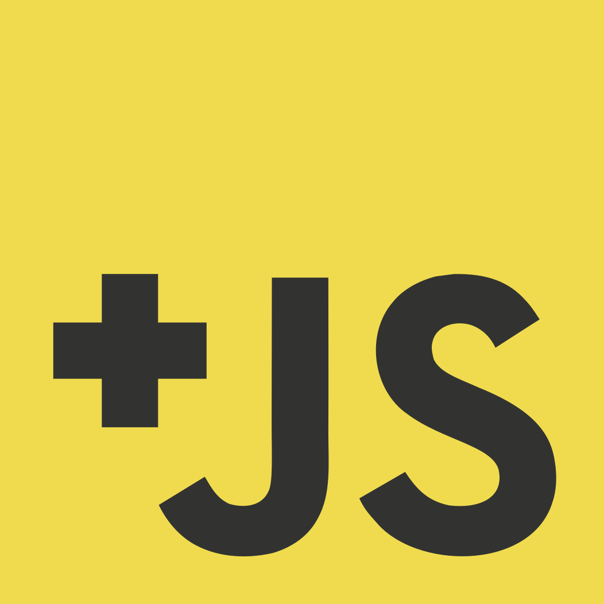

#  Advanced JavaScript syllabus

***If you are a teacher or interested in the design of the course, see the [meta](https://github.com/advanced-js/syllabus/blob/gh-pages/meta.md) document.***

* **Course:** [INFO1-CE9766, NYU SCPS](http://scps.nyu.edu/content/scps/academics/course_detail.html?id=INFO1-CE9766)
* **Instructor:** Aidan Feldman, [alf9@nyu.edu](mailto:alf9@nyu.edu)
* **Need help?**
    * 
        * It sends message digests to people who aren't active in the room, so feel free to ask a question even if no one's around.
    * Look through and create [issues](https://github.com/advanced-js/syllabus/issues)
    * Office Hours during [Hacker Hours](http://hackerhours.org/) (see [schedule](http://www.meetup.com/hackerhours/events/calendar/))
   * [Email](mailto:alf9@nyu.edu) for 1-on-1 help, or to set up a time to meet

## Course Description

Learn best practices in JavaScript in this intensive, five-session course. Topics include data encapsulation, closures, binding, inheritance, and name spacing. Discover some of the lesser-known, yet useful, features of the language, such as how to debug JavaScript problems on different browsers and improve performance. Create interactive webpages using third-party JavaScript libraries.

Computers are provided in the lab, though you are encouraged to bring a laptop for in-class exercises.

## Prerequisites

* [INFO1-CE9755 - JavaScript](http://scps.nyu.edu/content/scps/academics/course_detail.html?id=INFO1-CE9755) ([syllabus](http://samsultan.com/javascript)) or equivalent
* Understanding of variables, data types, control flow, and basic function usage in JavaScript
* Strong intermediate knowledge of HTML, and at least basics of CSS
* Basic jQuery knowledge (DOM interaction like adding/removing elements/classes, etc.)

These won't be enforced by the instructor, but you will be pretty lost without understanding those concepts. If you need a refresher, take a look at the [Beginner Materials](#beginner-materials).

## Course Overview

We will dive into the nuances of JavaScript, how prototypal inheritance compares to classical inheritance, and how this can be used to build dynamic and complex web applications.  Modern tools like jQuery and BackboneJS will be discussed, but students will learn the building blocks of these frameworks and after this course be able to understand what is happening under the hood.  The focus will be on development for browsers, though most applies to other systems like Node.js, Phonegap, etc.  Topics covered include:

* Encapsulation, closures and scope
* Classical vs. prototypal inheritance
* The event loop
* AJAX and JSONP
    * local
    * remote (e.g. Foursquare)
* Creating MVC-style models (a'la Backbone.js) from scratch
* Test- and Pseudocode-Driven Development

Topics will be demonstrated through live-code examples/slides, available at [advanced-js.github.io/deck](http://advanced-js.github.io/deck/).  Additional exercises will completed in-class.

See [this interview](https://web.archive.org/web/20140306162909/http://blog.masterstreet.com/2013/09/05/interview-with-aidan-feldman-instructor-at-nyu-scps/) for more background.

## Homework/Projects

All assignments are listed within the [Course Outline](#course-outline).

### Workflow

If you're using GitHub Desktop, these general instructions will help:

* <https://guides.github.com/activities/forking/>
* <https://help.github.com/desktop/guides/contributing/>

Enabling `Edit`->`Automatically Sync after Committing` is recommended. Here are the steps:

1. Fork the repository for the exercise/project (found under [github.com/advanced-js](https://github.com/advanced-js)).
1. Clone the repository to your computer.
1. Open the `index.html` file in a browser and open the Developer Tools.
1. Modify the files to complete your solution.
1. Refresh the `index.html` page to see the results, and repeat.
1. Make sure all of your code is committed.
1. Push/sync up to GitHub.
1. [Create a pull request](https://help.github.com/articles/creating-a-pull-request/) on the original repository. All assignments are due at the start of the following class, unless otherwise specified.
1. You can continue to push fixes and improvements until the close date (listed in Classes) – just add a comment in the pull request to let me know it's been updated.

When the pull request is created, you should see a message saying that "the Travis CI build is in progress" – this means that your solution is being automatically checked for syntax errors.  If this "build" ends up failing (which will show a red "X"), click through the "details" link and scroll to the bottom to see what the errors were.  Per the [requirements](#requirements) below, please fix the issues and push up the changes.

Feedback will be given in the pull request, so please respond with your thoughts and questions!  You are welcome to open the pull request early as a work-in-progress if you are stuck and want to ask a question.  Note that your solution will also be live at `http://USERNAME.github.io/EXERCISE`.

#### Versions

For exercises with multiple Versions (`V1`, `V2`, etc.) listed in the README: these are intended as guidelines for how to complete the assignments in the smallest/simplest possible increments.  You are expected to reach the highest Version for each assignment by the due date. See also: [extra credit](#extra-credit).

### Requirements

These apply to real life, as well.

* [Travis CI](https://docs.travis-ci.com/) build should pass, which includes:
    * All HTML files should pass [W3C Markup Validation](http://validator.w3.org).
    * All written JS should pass [JSHint](http://jshint.com).
* Must apply "good programming style" learned in class
    * Functions should be "short" (see [Sandi Metz's rules for developers](https://robots.thoughtbot.com/sandi-metz-rules-for-developers)).
    * Optimize for readability.
        * ["Programs must be written for people to read, and only incidentally for machines to execute." -Harold Abelson](https://www.goodreads.com/quotes/9168-programs-must-be-written-for-people-to-read-and-only)
    * Avoid using anonymous callbacks within other functions, especially if the callback is more than one or two lines.
    * For projects, use Object-Oriented Programming.
* Any borrowed code must be properly [annotated](#instructor).

#### Extra Credit

Bonus points for:

* Automated tests
* Creativity (as long as requirements are fulfilled)
* Anything listed under `BONUS` in the README of the exercise.

## Course Outline

### Class 1

<blockquote class="twitter-tweet" data-lang="en">
Are you new to front-end web development? Here&#39;s a secret: no one else really knows what they&#39;re doing either.
&mdash; Nicolas (@necolas) <a href="https://twitter.com/necolas/status/291978260433219584">January 17, 2013</a></blockquote>

1. Introduction
    * Put name on sticky note on back of monitor
    * Discuss what the class is going to cover
    * Everyone introduce themselves
        * Name
        * What you "do"
        * What are your goals for the class?
        * What's something in JS (or technology) you worry that your peers understand but you don't?
1. Setup
    * How many people are comfortable with Git/GitHub?
    * Install [GitHub Desktop](https://desktop.github.com/)
        * If you are comfortable with Git already, you can skip this.
    * Sign up for GitHub
1. GitHub workflow
    * Walk through [workflow](#workflow)
    * Create pull request on [students repository](https://github.com/advanced-js/students)
1. Explain how slides work
1. Get through `countdown_exercise` slide
1. Talk through [requirements](#requirements)

#### Homework

* Join [the chat room](https://gitter.im/advanced-js/syllabus).
* [Set up your GitHub profile.](https://github.com/settings/profile)
* Access [NYU Classes](https://newclasses.nyu.edu) page, where grades will be posted.
    * [Documentation](https://wikis.nyu.edu/display/nyuclasses/Student+Quick-Start)
* Read [JavaScript Garden](http://bonsaiden.github.io/JavaScript-Garden/).
* Finish up and submit [echo](https://github.com/advanced-js/echo) and [countdown](https://github.com/advanced-js/countdown) exercises.
* Complete [blink](https://github.com/advanced-js/blink) exercise.

### Class 2

1. Look at various approaches for `countdown()`
    * Show recursive solution
1. Developer Tools walkthrough
    * Elements (HTML)
    * Console (JS)
    * Scripts (JS)
1. Pair program to build [Memory v1](https://github.com/advanced-js/memory) (see [pairing tips](#pairing-tips))
1. Cover OOP, though "oop_inheritance" slide
    * [Encapsulation example](http://jsbin.com/baqopu/1/edit?css,js,output)
    * Look at [Backbone.js Events](http://backbonejs.org/docs/backbone.html)

#### Homework

* Read [Mozilla's Introduction to Object-Oriented Javascript](https://developer.mozilla.org/en-US/docs/Web/JavaScript/Introduction_to_Object-Oriented_JavaScript)
* [OOP exercise](https://github.com/advanced-js/oop), through V2
* [Memory v2](https://github.com/advanced-js/memory#v2) (individual)

### Class 3

1. Code review Memory
1. Get through [`oop_inheritance`](http://advanced-js.github.io/deck/examples/oop_inheritance/) slide
1. Cover automated testing
    * Build up a test framework from scratch
    * Examples in QUnit
        * [Simple](http://jsbin.com/woqusi/edit?html,js,output)
        * [Classes](http://jsbin.com/nukamun/edit?js,output)
        * [QUnit documentation](http://qunitjs.com/)
    * Other frameworks
1. Cover AJAX/CORS/JSONP ([files](https://github.com/advanced-js/deck/tree/gh-pages/demos/ajax))
    * Network tab in Developer Tools

#### Homework

* Read [Google JavaScript Style Guide](http://google-styleguide.googlecode.com/svn/trunk/javascriptguide.xml)
* Complete [OOP exercise](https://github.com/advanced-js/oop) through V4.
* [Memory V3](https://github.com/advanced-js/memory#v3)

### Class 4

1. Finish slides
1. Getting Serious example
    * Quick intro to Backbone.js
        * [Boilerplate](http://jsbin.com/IGivato/1/edit?html,js,output)
        * Click the Box [example app](http://jsbin.com/IGivato/5/edit?css,js,output)
        * TDD?
1. Multiple async
    * [Promises](https://github.com/advanced-js/deck/tree/gh-pages/demos/ajax/promises)/[jQuery.Deferred](http://api.jquery.com/jQuery.Deferred/)
    * Possibly show [async](https://github.com/caolan/async#control-flow-1) library?

#### Homework

* [Learn about AJAX](https://github.com/advanced-js/deck/tree/gh-pages/demos/ajax#readme)
* [Mashup](https://github.com/advanced-js/mashup)
* Improve your previous assignments

### Class 5

1. Present and code review Mashup projects
1. Possible topics (vote?):
    * Node.js
        * Server "Hello World" (from [Node.js homepage](http://nodejs.org/))
            * [HTTP module docs](http://nodejs.org/api/http.html)
        * HTTP requests
            * [Status codes](http://pretty-rfc.herokuapp.com/RFC2616#status.codes)
            * Headers
        * CommonJS?
    * [Regular Expressions](https://github.com/advanced-js/deck/tree/gh-pages/demos/regex.html)
        * Convert live input from a text area, e.g.
            * Link Twitter handles
            * Substitute select words for emoji, using [emoji-css](http://afeld.github.io/emoji-css/)
    * Object-Oriented design
    * [Code Retreat](http://coderetreat.org/facilitating/structure-of-a-coderetreat) – possible "problems":
        * [Game of Life](http://coderetreat.org/gol)
        * Tic Tac Toe

## Pairing Tips

* Three people is possible, but two works best
* Agree on an editor and environment that you're both comfortable with
* The person who's less experienced/comfortable should have more keyboard time
* Switch who's "driving" regularly
* Make sure to save the code and send it to both people

## Resources

### Required Reading

* [Google JavaScript Style Guide](http://google-styleguide.googlecode.com/svn/trunk/javascriptguide.xml)
* [JavaScript Garden](http://bonsaiden.github.com/JavaScript-Garden/)
* [Mozilla's Introduction to Object-Oriented Javascript](https://developer.mozilla.org/en-US/docs/Web/JavaScript/Introduction_to_Object-Oriented_JavaScript)
* [What’s so great about JavaScript Promises?](http://blog.parse.com/learn/engineering/whats-so-great-about-javascript-promises/)

### Beginner Materials

This class assumes you are confident with this material, but in case you need a brush-up...

* Codecademy – [JavaScript](https://www.codecademy.com/learn/javascript) and [jQuery](https://www.codecademy.com/learn/jquery)
* [Eloquent JavaScript](http://eloquentjavascript.net/index.html) by Marijn Haverbeke, Chapters 1-5
* [Want to learn JavaScript in 2015?](https://medium.com/@_cmdv_/i-want-to-learn-javascript-in-2015-e96cd85ad225)
* [How jQuery Works](https://learn.jquery.com/about-jquery/how-jquery-works/)
* see also – [Other Lists](#other-lists)

### Recommended Reading

* [Functional JavaScript](http://shop.oreilly.com/product/0636920028857.do) by Michael Fogus
* [Front-end Job Interview Questions](https://github.com/h5bp/Front-end-Developer-Interview-Questions) by @darcyclarke (for testing yourself)
* [JavaScript Best Practices](http://www.thinkful.com/learn/javascript-best-practices-1/)
* [JavaScript Patterns](http://shichuan.github.io/javascript-patterns/) by @shichuan (thanks @iandrewfuchs)
* [JavaScript Patterns](http://www.amazon.com/JavaScript-Patterns-Stoyan-Stefanov/dp/0596806752) by Stoyan Stephanov
* [JavaScript Web Applications](http://www.amazon.com/JavaScript-Web-Applications-Alex-MacCaw/dp/144930351X/) by Alex MacCaw
* [JavaScript: The Good Parts](http://www.amazon.com/JavaScript-Good-Parts-Douglas-Crockford/dp/0596517742) by Douglas Crockford
* [Learning Advanced JavaScript slides](http://ejohn.org/apps/learn/) by John Resig
* [Static Web Apps](http://www.staticapps.org/)
* [Test-Driven JavaScript Development](http://www.amazon.com/Test-Driven-JavaScript-Development-Developers-Library/dp/0321683919) by Christian Johansen
* [The JavaScript Interpreter, Interpreted](http://www.slideshare.net/marthakelly/js-interpreter-interpreted) by Martha Girdler [(video)](https://www.youtube.com/watch?v=iSxNCYcPAFk)

#### Specific Topics

* [Classical Inheritance in JavaScript](http://www.crockford.com/javascript/inheritance.html) by Douglas Crockford
* [Partial Application in JavaScript](http://benalman.com/news/2012/09/partial-application-in-javascript/) by Ben Alman (thanks @michaelBenin)
* [HTML5 Rocks](http://www.html5rocks.com)
* [Learning JavaScript Design Patterns](http://addyosmani.com/resources/essentialjsdesignpatterns/book/) by Addy Osmani

#### Other Lists

* [JS: The Right Way](http://www.jstherightway.org/) (an overview of the JS landscape)
* [Code School](https://www.codeschool.com/paths/javascript)
* Thoughtbot's [Javascript Trail Map](https://upcase.com/javascript)
* [How To Learn JavaScript Properly](http://javascriptissexy.com/how-to-learn-javascript-properly/)
* [Superhero.js](http://superherojs.com)
* [Teach Yourself to Code](http://teachyourselftocode.com/javascript)

### Tools

* code validation: [JSLint](http://jslint.com) / [JSHint](http://jshint.com)
* debugging:
    * [Chrome Developer Tools](https://developer.chrome.com/devtools/index)
        * [Official debugging tutorial](https://developer.chrome.com/extensions/tut_debugging)
        * Tutorial: [JavaScript Diagnosis](http://www.macwright.org/2015/03/10/javascript-diagnosis.html)
    * [Firefox Developer Edition](https://www.mozilla.org/en-US/firefox/developer/)
* sharing code snippets: [gist.github.com](https://gist.github.com/)
* asking questions: [Stack Overflow](http://stackoverflow.com/)

#### GitHub

* Git and GitHub
    * [Official GitHub Help](https://help.github.com/)
    * [Recommended resources](http://hackerhours.org/resources.html#github)
* GitHub Pages
    * [Official site](https://pages.github.com/)
    * [Thinkful guide](http://www.thinkful.com/learn/a-guide-to-using-github-pages/)

#### HTML/CSS/JS Sandboxes

* [JS Bin](http://jsbin.com/) (recommended)
* [bl.ocks.org](http://bl.ocks.org/)
* [Cloud9](https://c9.io/)
* [CodePen](http://codepen.io/pen/)
* [JSFiddle](http://jsfiddle.net/)
* [Mozilla Thimble](https://thimble.mozilla.org)
* [Plunker](http://plnkr.co/)
* [rawgithub.com](http://rawgit.com/)

#### Frameworks

* Framework comparison: [TodoMVC](http://todomvc.com)
* [Testing](https://coderwall.com/p/ntbixw)

### Reference

* [Mozilla Developer Network](https://developer.mozilla.org/en/JavaScript) and [Learn JavaScript](https://developer.mozilla.org/en-US/learn/javascript)
* [w3schools](http://www.w3schools.com/jsref/default.asp)
* [JavaScript: The Definitive Guide](http://shop.oreilly.com/product/9780596000486.do) by David Flanagan
* [Simplified JavaScript Jargon](http://jargon.js.org/)

### More Examples

* [map/reduce](http://jsbin.com/ojapAsUR/2/edit?js) (in [Underscore](http://underscorejs.org/#map))

## Grading

* Class Participation – 30%
* Homework – 70%

## Statements on Plagiarism

### SCPS

> New York University takes plagiarism very seriously and regards it as a form of fraud.  The definition of plagiarism that has been adopted by the School of Continuing and Professional Studies is as follows: "Plagiarism is presenting someone else's work as though it were one's own.  More specifically, plagiarism is to present as one's own words quoted without quotation marks from another writer; a paraphrased passage from another writer’s work; or facts or ideas gathered, organized, and reported by someone else, orally and/or in writing.  Since plagiarism is a matter of fact, not of the student's intention, it is crucial that acknowledgement of the sources be accurate and complete.  Even where there is not a conscious intention to deceive, the failure to make appropriate acknowledgement constitutes plagiarism.  Penalties for plagiarism range from failure for a paper or course to dismissal from the University.

### Instructor

Reuse and building upon ideas or code are major parts of modern software development.  As a professional programmer you will never write anything from scratch.  This class is structured such that all solutions are public.  You are encouraged to learn from the work of your peers.  I won't hunt down people who are simply copying-and-pasting solutions, because without challenging themselves, they  are simply wasting their time and money taking this class.

Please respect the terms of use and/or license of any code you find, and if you reimplement or duplicate an algorithm or code from elsewhere, credit the original source with an inline comment.
